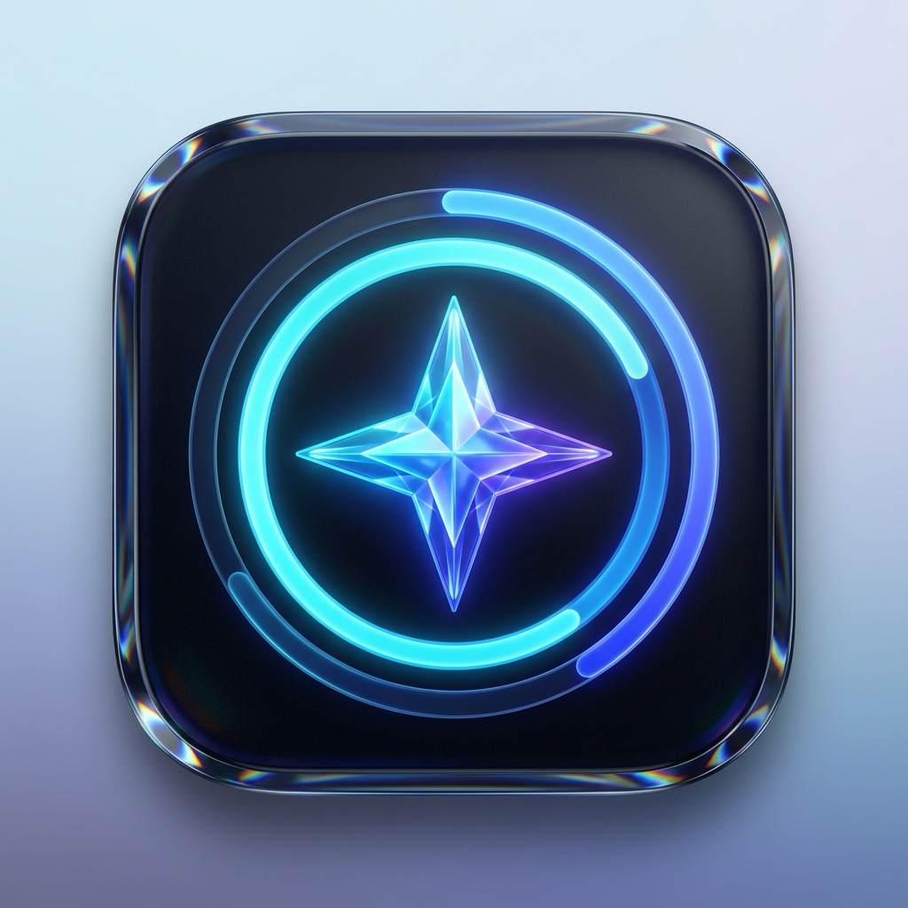
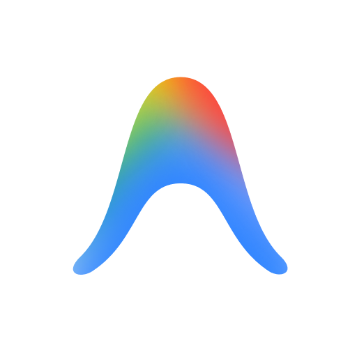
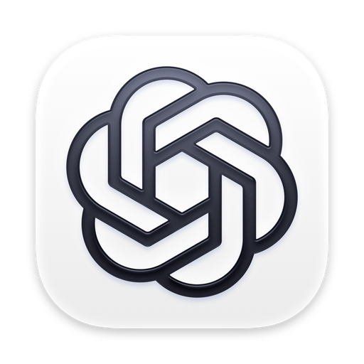
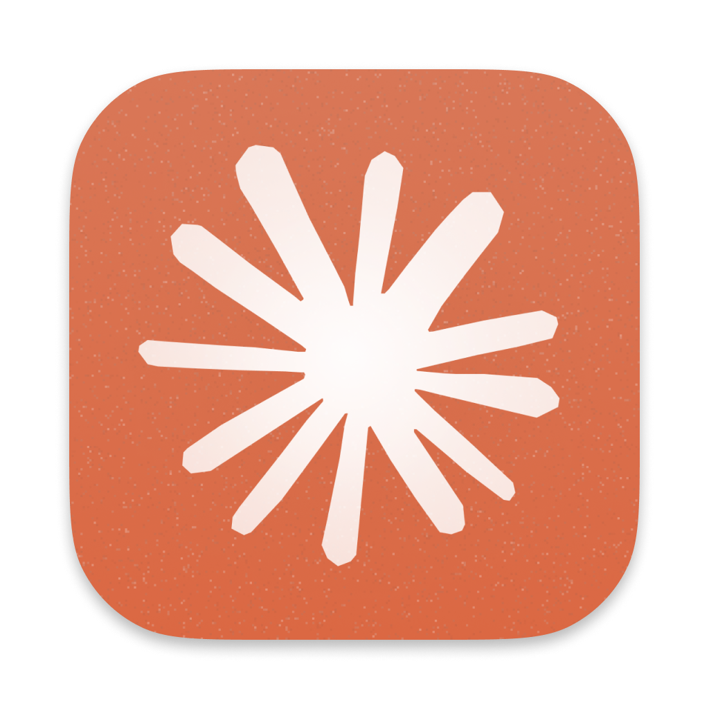

<p align="center">
  
</p>

<h1 align="center">AIUsage</h1>

<p align="center">
  <b>A sleek, native macOS menu bar app for instant, real-time access to your AI Model Quotas and account usage.</b>
  <br />
  Built in Swift &amp; SwiftUI &bull; macOS 27 Liquid Glass UI &bull; Zero Prompt Token Overhead
</p>

<p align="center">
  <a href="https://github.com/desmondlee95700/AIUsage/releases/latest"></a>
  
  
  
  <a href="LICENSE"></a>
</p>

---

## ⬇️ Download & Installation

### Option 1: Direct Download (Recommended)
Download the latest pre-compiled macOS disk image:

👉 **[Download AIUsage.dmg](https://github.com/desmondlee95700/AIUsage/releases/latest/download/AIUsage.dmg)**

1. Open `AIUsage.dmg`.
2. Drag **AIUsage.app** into your `/Applications` folder.
3. Launch **AIUsage** — it will immediately appear in your macOS menu bar!

> [!TIP]
> **macOS Gatekeeper Notice ("AIUsage is damaged and can't be opened")**:  
> Because AIUsage is an independent open-source app distributed outside the Mac App Store without an Apple Developer ID certificate, macOS attaches a quarantine flag to files downloaded via browsers (Chrome, Safari) and blocks them.
> 
> If you see this warning, open **Terminal** and run this one-line command:
> ```bash
> xattr -cr /Applications/AIUsage.app
> ```
> *(Or navigate to **System Settings > Privacy & Security**, scroll down to **Security**, and click **Open Anyway**.)*

---

## ✨ Features

### 🤖 Multi-Provider Capabilities Matrix

| Provider | Tracked Metrics | Connection Protocol | Token Overhead | Auto-Discovery |
| :--- | :--- | :--- | :---: | :---: |
|  **Google Antigravity** | • Rolling 5-Hour Limit<br>• Weekly Quota Limit<br>• Prompt & Flow Credits<br>• Google Account Tier & Email | Local Connect-RPC (`127.0.0.1`) | **0 Tokens** | ✅ Instant |
|  **OpenAI ChatGPT** | • 5-Hour Burst Limit<br>• Weekly Quota Limit<br>• Reset Credit Redemption<br>• OpenAI Plan & Email | Local Codex JSON-RPC stdio | **0 Tokens** | ✅ Instant |
|  **Anthropic Claude** | • 5-Hour Rolling Burst<br>• Weekly Quota Limit<br>• Claude 3.7 Sonnet Allocation<br>• Free Tier Dynamic Capacity | Local Desktop Session Cookies | **0 Tokens** | ✅ Instant |

<br />

### 🍎 App & macOS Experience

| Feature | Description |
| :--- | :--- |
| 🎛️ **Flexible Provider Focus** | Toggle any combination of active models (Antigravity, ChatGPT, Claude) with persistent in-menu checkboxes and an in-popover filter slider. |
| 📊 **Menu Bar Telemetry** | Displays side-by-side metrics (e.g. `78% · 90% · Free`) with native template glyphs and detailed multi-model hover tooltips. |
| 🪟 **macOS 27 Liquid Glass** | Native `.ultraThinMaterial` substrate, specular rim refraction gradients, viscous spring mechanics, and auto-expanding popover without scrollbars. |
| 🔒 **100% Private & Local** | Zero external telemetry, zero LLM prompts consumed, and no credentials saved. Communicates strictly over local IPC. |
| 🔄 **Auto-Discovery & Recovery** | Automatically detects running desktop instances and seamlessly reconnects whenever any AI application is launched or restarted. |

---

## 🛠️ Building from Source

```bash
# Clone the repository
git clone https://github.com/desmondlee95700/AIUsage.git
cd AIUsage

# Build and package the .app bundle
./scripts/build_app.sh

# Or create a distributable compressed DMG
./scripts/build_dmg.sh

# Launch the app
open AIUsage.app
```

---

## ⚙️ Controls & Shortcuts

- **Left-Click Menu Bar Item**: Toggles the interactive quota breakdown popover.
- **Right-Click Menu Bar Item**: Opens quick context menu (Refresh Now, Quit AIUsage).
- **Header Action Buttons**:
  - **Refresh (🔄)**: Forces an immediate re-probe and quota fetch.
  - **Quit (⏻)**: Terminates the menu bar application.

---

## 📄 License
MIT License.
